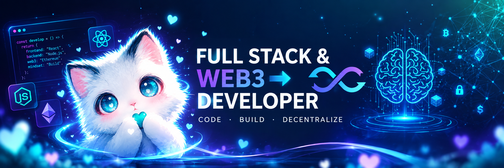

## 👋 Hey there!

I'm a <strong style="color: #e4cd00">Full Stack & Web3 Developer</strong> — I turn ideas into fast, scalable applications and ship smart contracts & decentralized products that people can actually use. On the frontend I craft pixel-perfect, buttery-smooth experiences; on the backend I design battle-tested APIs and rock-solid architectures; and on-chain I build EVM smart contracts that are secure by design. From the first commit to the final block, I love owning the whole stack.

<blockquote style="font-size: 1.2em; padding: 8px;"> <marquee> <b style="color: #e4cd00">Full-stack and Web3 Developer</b> building scalable apps and smart contracts that go from idea to on-chain reality</marquee></blockquote>

---

## 📈 Statistics

## 💻 Tech Stack

<h3>Languages</h3>
    

        &emsp;
        &emsp;
        &emsp;
        &emsp;
        &emsp;
        &emsp;
    

 

<h3>Frontend</h3>
    

        &emsp;
        &emsp;
        &emsp;
        &emsp;
        &emsp;
        &emsp;      
    

 

<h3>Backend & APIs</h3>
    

        &emsp;
        &emsp;
        &emsp;
        &emsp;
        &emsp;
        &emsp;
    

 

<h3>Databases & ORMs</h3>
    

        &emsp;
        &emsp;
        &emsp;
        &emsp;
    

 

<h3>Web3 & Blockchain</h3>
    

        &emsp;
        &emsp;
        &emsp;
        &emsp;
        &emsp;
    

    Also working with: Hardhat · Foundry · Viem · The Graph · OpenZeppelin

 

<h3>Tools & Platforms</h3>
    

        &emsp;
        &emsp;
        &emsp;
        &emsp;
        &emsp;
        &emsp;
    

 

## 🐍 Contribution Snake

<picture>
  <source media="(prefers-color-scheme: dark)" srcset="https://raw.githubusercontent.com/AdsonCleidirMartins/AdsonCleidirMartins/output/github-contribution-grid-snake-dark.svg?v=1">
  <source media="(prefers-color-scheme: light)" srcset="https://raw.githubusercontent.com/AdsonCleidirMartins/AdsonCleidirMartins/output/github-contribution-grid-snake.svg?v=1">
  
</picture>
